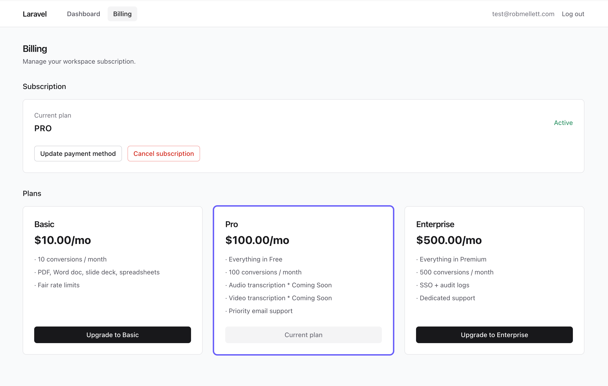
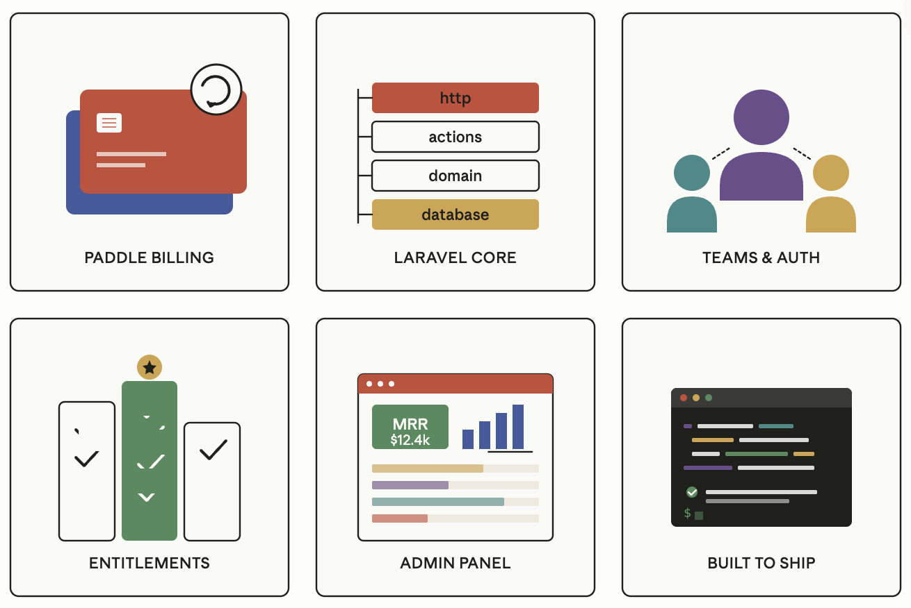

# ModernSaaS — Laravel + Paddle Starter Kit
A production-ready Laravel SaaS starter kit with Paddle billing baked in, so you can skip the boilerplate and ship your
actual product.



## Who is this for?
Solo developers, small teams, and indie hackers who want to launch a subscription-based SaaS without spending the first
two months wiring up auth, billing, teams, and webhooks. It assumes you're comfortable with Laravel — this isn't a
no-code tool, it's a head start for people who'd otherwise be writing the same subscriptions migration for the fifth
time.

It's also a fit for agencies prototyping SaaS products for clients, and developers migrating off Stripe who want
Paddle's Merchant of Record model to handle global tax compliance.

## Why use it?
Most SaaS starters either lock you into opinionated frontends you'll fight forever, or hand you a skeleton so bare you
still spend weeks on plumbing. ModernSaaS aims for the middle: modern Laravel conventions (actions, DTOs, form requests,
policies) with the billing layer fully wired up against Paddle's current API — including the webhook signature
verification and subscription lifecycle edge cases that usually bite you in production.

Paddle as Merchant of Record means you don't have to register for VAT/GST in 40 jurisdictions or build your own tax
engine. The starter is built around that assumption from day one.

## Features



### Billing & subscriptions (Paddle)
Paddle Billing integration via Cashier Paddle, with checkout overlays, customer portal, subscription
pause/resume/cancel, plan switching with prorations, trial periods, one-time charges, and webhook handlers for every
relevant event (subscription created/updated/cancelled, transaction completed, payment failed, refunds). Includes a
dunning flow for failed payments.

### Authentication & teams
Email/password and magic link auth, email verification, two-factor authentication, password resets, and social login
scaffolding (Google, GitHub). Team workspaces with invitations, roles (owner/admin/member), and per-team subscription
billing — so one user can belong to multiple teams, each with its own plan.

### Plans & entitlements
A clean entitlements layer that maps Paddle products to feature flags and usage limits (e.g., "Pro plan: 10 projects,
50GB storage"). 

Middleware and policies enforce limits without scattering if `($user->plan === 'pro')` checks across your
codebase.

### Admin dashboard
Filament-powered admin panel for managing users, teams, subscriptions, refunds, and viewing MRR/churn metrics.
Impersonation for support, with audit logging.

### Developer experience
Built on Laravel 11+, Livewire/Volt or Inertia + React (your pick at install), Tailwind CSS, Pest for tests, and a
domain-oriented folder structure following Laravel Beyond CRUD patterns. Includes seeders, factories, and a complete
Pest test suite covering the billing flows. Docker Compose for local dev, GitHub Actions CI, and a one-command deploy
script for Laravel Cloud.

### Production essentials
Transactional email via Resend/Postmark, queued jobs with Horizon, rate limiting, CSP headers, GDPR-friendly data export
and account deletion endpoints, and Sentry integration for error tracking.

### Really simple deployment
One click deploy to Laravel Cloud

## Stack

- **PHP** 8.3+ (developed on 8.4) · **Laravel** 13 · **Livewire** 4
- **DB** PostgreSQL via Laravel Sail in dev; SQLite in-memory for tests
- **Frontend** Vite 8 + TailwindCSS 4 + plain Blade (no Inertia / Filament)
- **Auth** Laravel Fortify (custom Blade views, no email verification, 2FA columns present but no UI)
- **Billing** Laravel Cashier Paddle (Paddle Billing — current product, not Classic)
- **DTOs** spatie/laravel-data
- **Quality** Pint, Larastan, PHPUnit 12

## Architecture (Laravel Beyond CRUD)

Domain logic lives inside `src/Domain/<BoundedContext>/` tree. 

Framework wiring (controllers, providers, middleware) stays in `app/`. 

Eloquent models stay in `app/Models/`.

```
app/
├── Http/Middleware/         RequiresPlan
├── Livewire/Billing/        PlanPicker, SubscriptionPanel
├── Models/                  User, Workspace
└── Providers/               AppServiceProvider, FortifyServiceProvider
src/Domain/
├── Billing/
│   ├── Actions/             StartCheckoutAction
│   ├── Data/                PlanData (DTO from config/billing.php)
│   └── Listeners/           SyncSubscriptionPlan
├── Users/
│   ├── Actions/             CreateNewUser, ResetUserPassword, UpdateUserPassword,
│   │                        UpdateUserProfileInformation, PasswordValidationRules
│   └── Data/                RegisterUserData
└── Workspaces/
    ├── Actions/             CreatePersonalWorkspaceAction
    ├── Enums/               WorkspacePlan, WorkspaceRole
    └── Policies/            WorkspacePolicy
```

Composer autoload: 
 - `App\\: app/`, 
 - `Domain\\: src/Domain/`, 
 - `Support\\: src/Support/`

## Setup

```bash
git clone <repo>
cd saas-starter-livewire

cp .env.example .env

# See Billing section for more information on setting up Paddle.
PADDLE_SANDBOX=true
PADDLE_CLIENT_SIDE_TOKEN=your-paddle-client-side-token
PADDLE_API_KEY=
PADDLE_WEBHOOK_SECRET="your-paddle-webhook-secret"

composer install
npm install
php artisan key:generate

./vendor/bin/sail up -d
./vendor/bin/sail artisan migrate

npm run dev 
```

Open [http://localhost](http://localhost). 

Mailpit (password-reset emails) at <http://localhost:8025>.

## Routes

| Method | Path | Name | Notes |
|---|---|---|---|
| GET | `/` | — | Welcome page |
| GET | `/up` | — | Laravel health check |
| **Auth (Fortify)** | | | |
| GET | `/login` | `login` | Custom Blade view |
| POST | `/login` | `login.store` | |
| POST | `/logout` | `logout` | |
| GET | `/register` | `register` | Creates user + personal workspace |
| POST | `/register` | `register.store` | |
| GET | `/forgot-password` | `password.request` | |
| POST | `/forgot-password` | `password.email` | Sends reset email |
| GET | `/reset-password/{token}` | `password.reset` | |
| POST | `/reset-password` | `password.update` | |
| PUT | `/user/profile-information` | `user-profile-information.update` | |
| PUT | `/user/password` | `user-password.update` | |
| GET / POST | `/user/confirm-password` | `password.confirm[.store]` | |
| **2FA (routes exist, no UI yet)** | | | |
| POST / DELETE | `/user/two-factor-authentication` | `two-factor.enable/disable` | |
| GET | `/two-factor-challenge` | `two-factor.login` | |
| **App** | | | |
| GET | `/dashboard` | `dashboard` | Auth required; shows current workspace |
| GET | `/billing` | `billing` | Auth required; PlanPicker + SubscriptionPanel |
| GET | `/billing/pending` | `billing.pending` | Auth required; the post-checkout landing page. Polls every 2s for the `subscription.created` webhook, then redirects to `/billing` |
| GET | `/billing/payment-method` | `billing.payment-method` | Owner only; lazily fetches Paddle's payment-method URL and 302s to it. Redirects back with a session error on Paddle API failure |
| **Billing webhooks** | | | |
| POST | `/paddle/webhook` | `cashier.webhook` | Paddle webhook receiver; signature verified by Cashier |
| **Livewire internals** | | | |
| POST | `/livewire-*/update` | `default-livewire.update` | Component hydration |
| various | `/livewire-*/...` | — | Asset / file upload endpoints |

Run `./vendor/bin/sail artisan route:list` for the live list.

## How auth works

Fortify owns the routes; we override behavior via Action classes and view callbacks.

1. **`Domain\Users\Actions\CreateNewUser`** is bound to Fortify's `CreatesNewUsers` contract in `App\Providers\FortifyServiceProvider::boot()`. It validates input through `Domain\Users\Data\RegisterUserData` (Spatie laravel-data with rules attached to the DTO), creates the `User`, and within the same DB transaction invokes `Domain\Workspaces\Actions\CreatePersonalWorkspaceAction` which:
   - Creates a `Workspace` named e.g. `"Mark's Workspace"`
   - Attaches the user to the `workspace_user` pivot with role `owner`
   - Sets `users.current_workspace_id` to the new workspace
2. Login / logout / forgot-password / reset are all stock Fortify routes; we provide the views via `Fortify::loginView(fn () => view('auth.login'))` etc.
3. Email verification is **disabled** in `config/fortify.php`. 2FA columns exist on `users` but no UI ships yet — flip features off if you don't want the routes exposed.

Layouts live as anonymous Blade components in `resources/views/components/layouts/`:
- `guest.blade.php` — unauthenticated screens
- `app.blade.php` — authenticated screens (includes `@livewireStyles`, `@livewireScripts`, `@stack('head')`, `@stack('scripts')`)

## How billing works

### Paddle Integration Checklist

1. Create a Paddle account, and a sandbox account for testing.
2. Create a Product in Paddle. 
3. Set your default Payment link In Paddle
4. Create a Client Side Token in Paddle.
5. Open a checkout and test a payment link
6. Configure the Paddle webhook URL in Paddle.
   - Under `Developer Tools > Notifications`.
   - The default Laravel cashier URL is `http://localhost/paddle/webhook`.


### Tenant model: subscriptions belong to a `Workspace`, not a `User`. 

The `Laravel\Paddle\Billable` trait is on `App\Models\Workspace`.

### Plans are configured in `config/billing.php`:

```
Free       — no config entry; emitted by Workspace::currentPlan() when !subscribed()
Basic      — env('PADDLE_PRICE_BASIC')
Pro        — env('PADDLE_PRICE_PRO')
Enterprise — env('PADDLE_PRICE_ENTERPRISE')
```

`Domain\Billing\Data\PlanData::catalog()` returns Basic/Pro/Enterprise as DTOs.

### Workspace as billable:

Cashier-Paddle's default `paddleEmail()` reads `$this->email`. 

Workspace has no `email` column, so we override `Workspace::paddleEmail()` to return the owner user's email. Without that override, `Model::shouldBeStrict()` throws on the missing-attribute access.

### Checkout flow (Livewire + Paddle.js overlay):

1. User on `/billing` sees `<livewire:billing.plan-picker />`
2. Clicks "Upgrade to Pro" → fires `wire:click="subscribe('pro')"` on `App\Livewire\Billing\PlanPicker`
3. Component authorizes (`manageBilling` policy = Owner only), calls `Domain\Billing\Actions\StartCheckoutAction` which builds a `Laravel\Paddle\Checkout` via `$workspace->subscribe($priceId)` (creating the Paddle customer record on first use; idempotent thereafter)
4. Component dispatches a browser event `paddle-checkout` with the checkout config
5. JS handler in `resources/views/billing/index.blade.php` calls `Paddle.Checkout.open(config)`, the Paddle overlay opens
6. User completes payment in the overlay
7. Paddle sends webhooks to `/paddle/webhook` *and* redirects the user to `/billing/pending?_ptxn=txn_xxx` (the `successUrl` set by `StartCheckoutAction::returnTo()` — a dedicated "Processing payment" page, not back to `/billing` directly)
8. `App\Livewire\Billing\PendingPayment` renders a full-page spinner and `wire:poll`s `checkSubscription()` every 2 seconds. If the workspace already has a subscription on mount (e.g., user refreshed after webhook landed), it redirects straight to `/billing`. After 60 seconds (`PendingPayment::PROCESSING_TIMEOUT_SECONDS`) the polling stops and the page switches to a "Still confirming" state with a manual Check again button and a Back to billing link
9. Cashier creates `subscriptions` + `subscription_items` rows, dispatches `Laravel\Paddle\Events\SubscriptionCreated`
10. `Domain\Billing\Listeners\SyncSubscriptionPlan` writes `workspaces.plan` from the subscription's price ID
11. The next `wire:poll` tick on `PendingPayment` sees the subscription, returns `redirect()->route('billing')`, and the user lands on `/billing` with the normal "Active" view — no manual refresh needed

`SubscriptionPanel` itself is now stateless: it only cares about whether a subscription row exists *now*. All post-checkout polling lives on `PendingPayment`.

The Paddle.js script is injected by `@paddleJS` (a Cashier directive) on the `/billing` page only — we don't load it globally.

### Workspace plan logic

**Reading the current plan**: always call `$workspace->currentPlan()`, never the raw `plan` column.

```php
# App\Models\Workspace.php

public function currentPlan(): WorkspacePlan
{
    if (! $this->subscribed()) {
        return WorkspacePlan::Free;
    }

    if ($this->subscription()?->hasPrice($enterprisePriceId)) {
        return WorkspacePlan::Enterprise;
    }
    
    // ....
}
```

The `workspaces.plan` column is a denormalized cache, useful for `WHERE plan = 'pro'` queries.

**Don't authorize off it** — Cashier's `subscribed()` is the source of truth, and `currentPlan()` wraps it.

**Cancellation**: `SubscriptionPanel::cancel()` calls `$subscription->cancel()`. Paddle keeps the subscription active until `ends_at`. The listener does NOT subscribe to `SubscriptionCanceled`, so `workspaces.plan` stays on the paid tier for the read-side cache. Once the grace period elapses, Cashier's `subscribed()` returns false → `currentPlan()` returns Free. No scheduled job needed.

**Resume**: during grace period, `SubscriptionPanel::resume()` calls `$subscription->stopCancelation()` (NOT `resume()` — that method is for *paused* subscriptions and throws `LogicException` on canceled ones).

**Update payment method**: the panel renders a plain link to `route('billing.payment-method')` (handled by `App\Http\Controllers\Billing\PaymentMethodController`). That controller calls `$subscription->paymentMethodUpdateUrl()` *only when the user clicks the button* and 302s straight to Paddle. Two reasons not to call this on render:

- `paymentMethodUpdateUrl()` hits Paddle's API (`GET subscriptions/{id}`) — doing it on every billing-page render adds ~100–300ms per page load.
- If the local `subscriptions` row points at a Paddle ID that no longer exists (stale `paddle:fake-webhook` seed, environment rotation), the render would explode. The deferred-fetch model isolates that failure to the click and redirects back to `/billing` with a session error.

### Required env vars

```
PADDLE_SANDBOX=true               # false for production
PADDLE_SELLER_ID=
PADDLE_API_KEY=
PADDLE_CLIENT_SIDE_TOKEN=         # used by Paddle.js
PADDLE_WEBHOOK_SECRET=
PADDLE_PRICE_BASIC=pri_xxx
PADDLE_PRICE_PRO=pri_xxx
PADDLE_PRICE_ENTERPRISE=pri_xxx
```

### Testing webhooks locally

Two options:

**1. Fake them with the artisan command** (no internet round-trip):

```bash
# Default: subscription.created against the first workspace that has a Paddle customer
./vendor/bin/sail artisan paddle:fake-webhook

# Pin the event, workspace, plan, and subscription ID
./vendor/bin/sail artisan paddle:fake-webhook subscription.created \
  --workspace=1 --price=enterprise --id=sub_my_test_001

# Other supported events
./vendor/bin/sail artisan paddle:fake-webhook subscription.updated --workspace=1
./vendor/bin/sail artisan paddle:fake-webhook subscription.canceled --workspace=1
./vendor/bin/sail artisan paddle:fake-webhook transaction.completed --workspace=1
```

The command builds a realistic Paddle payload, signs it with `PADDLE_WEBHOOK_SECRET`, and POSTs to your local `/paddle/webhook`. It refuses to run when `APP_ENV=production`. The customer must already exist locally — visit `/billing` as the workspace owner once to create the Paddle customer record (this is the only step that requires Paddle's live API).

**2. Receive real Paddle webhooks** (full round-trip):

Expose the app to the public internet (e.g. `cloudflared tunnel --url http://localhost`) and register the tunnel URL + `/paddle/webhook` in Paddle's dashboard. Paddle will then post real events as customers move through checkout.

## Authorization

`Domain\Workspaces\Policies\WorkspacePolicy` is auto-discovered via `#[UsePolicy]` on `Workspace`:

```php
$user->can('view', $workspace)            // member?
$user->can('manageBilling', $workspace)   // owner only
$user->can('manageMembers', $workspace)   // owner or admin
```

Roles are stored on the `workspace_user` pivot's `role` column as `WorkspaceRole` enum values.

## Plan Middleware

Route middleware: `plan:<csv>` (alias for `App\Http\Middleware\RequiresPlan`).

```php
Route::middleware(['auth', 'plan:pro,enterprise'])->group(function () {
    // routes only available to Pro and Enterprise workspaces
});

Route::middleware(['auth', 'plan:enterprise'])->group(function () {
    // enterprise-only
});
```

The middleware reads `$user->currentWorkspace->currentPlan()`, so grace-period downgrades happen automatically.

## Quality of life dev defaults

`AppServiceProvider::boot()` wires:
- `Model::shouldBeStrict()` in non-production — lazy loading, missing attributes, and silently-discarded attributes all throw. Fix the call site rather than relax the rule.
- `DB::prohibitDestructiveCommands()` in production — blocks `migrate:fresh`, `db:wipe`, etc.
- `Factory::guessFactoryNamesUsing()` — keeps factory resolution working as we add more models.

## Testing

```bash
./vendor/bin/sail artisan test
```

Feature tests covering:
 - registration + workspace bootstrap
 - login
 - password reset
 - dashboard auth gate
 - billing page render
 - plan middleware + workspace policy
 - `SyncSubscriptionPlan` listener (Pro/Enterprise/Updated/unknown-price fallback)
 - `PlanPicker` Livewire checkout dispatch (via `Cashier::fake()`)
 - `SubscriptionPanel` cancel/resume/error paths (via `Cashier::fake()`)
 - `PendingPayment` post-checkout landing page (auth gate, render with `_ptxn`, redirect to `/billing` once the subscription appears, timeout state)
 - `PaymentMethodController` (owner-only authz, redirect to Paddle, graceful fallback on API error / missing subscription)
 - Paddle webhook signature verification (valid, missing, tampered, stale-timestamp)
 - `paddle:fake-webhook` artisan command (payload shape + HMAC signature header)

Tests use `LazilyRefreshDatabase` against the Sail Postgres container — each test runs in a transaction so data doesn't leak.

## Console Commands

```bash
./vendor/bin/sail up -d                                          # start containers
./vendor/bin/sail artisan migrate                                # apply migrations
./vendor/bin/sail artisan test                                   # run the suite
./vendor/bin/sail artisan tinker                                 # REPL
./vendor/bin/sail artisan paddle:fake-webhook [event] [options]  # sign + POST a Paddle webhook locally (dev only)
./vendor/bin/pint                                                # format
./vendor/bin/phpstan analyse                                     # static analysis (Larastan, level 6)

npm run dev                                                      # Vite dev server (host-side)
npm run build                                                    # production bundle
```

## References

- [Laravel Cashier](https://laravel.com/docs/billing)
- [Laravel Cashier Paddle](https://github.com/laravel/cashier-paddle)
- [Paddle Docs](https://developer.paddle.com/docs)
- [Paddle Webhooks](https://developer.paddle.com/webhooks)
